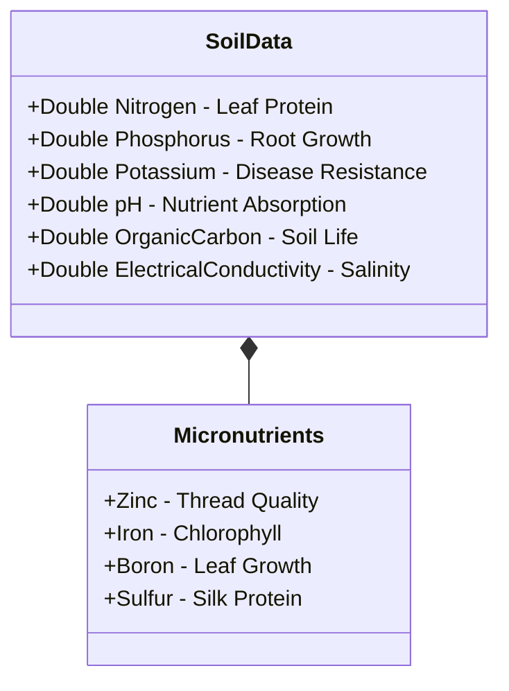

# 🌿 Seri-Helper: Complete User Guide & Sericulture Dictionary

Welcome to the **Seri-Helper** User Guide! This guide is designed to help you, the farmer, understand the scientific concepts behind sericulture and easily operate the Seri-Helper mobile application. By digitizing your soil reports, scanning your mulberry leaves, and tracking rearing house climates, this app helps you predict and maximize your cocoon yield.

---

```mermaid
graph TD
    %% Styling
    classDef stepClass fill:#e1f5fe,stroke:#0288d1,stroke-width:2px,color:#01579b;
    classDef startClass fill:#e8f5e9,stroke:#2e7d32,stroke-width:2px,color:#1b5e20;
    classDef endClass fill:#ede7f6,stroke:#7e57c2,stroke-width:2px,color:#4a148c;
    
    A([Start: Open Seri-Helper]) :::startClass --> B[Step 1: Setup Batch - Config Batch] :::stepClass
    B --> C[Step 2: Scan Mulberry Leaf - Leaf Scan] :::stepClass
    C --> D[Step 3: Scan Soil Card - Soil Scan] :::stepClass
    D --> E[Step 4: Check Yield Dashboard & Simulate Climate] :::stepClass
    E --> F([Step 5: Save Forecast to History]) :::endClass
```

---

## 📖 Table of Contents
1. [📖 Chapter 1: Dictionary of Sericulture & App Terms](#-chapter-1-dictionary-of-sericulture--app-terms)
   - [Silkworm & Rearing Terms](#1-silkworm--rearing-terms)
   - [Mulberry Leaf & Foliage Terms](#2-mulberry-leaf--foliage-terms)
   - [Soil, Nutrition & Fertilizer Terms](#3-soil-nutrition--fertilizer-terms)
   - [App Indexes & Metric Metrics](#4-app-indexes--metric-metrics)
2. [📱 Chapter 2: Step-by-Step App Operation Guide](#-chapter-2-step-by-step-app-operation-guide)
   - [Step 1: Setting Up Your Batch](#step-1-setting-up-your-batch)
   - [Step 2: Scanning Mulberry Leaves](#step-2-scanning-mulberry-leaves)
   - [Step 3: Scanning Your Soil Health Card](#step-3-scanning-your-soil-health-card)
   - [Step 4: Analyzing the Yield Dashboard & Simulating Weather](#step-4-analyzing-the-yield-dashboard--simulating-weather)
3. [💡 Chapter 3: Practical Action Plan & Reference Guide](#-chapter-3-practical-action-plan--reference-guide)

---

## 📖 Chapter 1: Dictionary of Sericulture & App Terms

Understanding these terms will help you interpret the app's recommendations and improve your daily farming operations.

### 1. Silkworm & Rearing Terms

#### 🐛 **DFLs (Disease Free Layings)**
* **Definition:** Silkworms lay eggs in clusters. One "laying" is a group of about 400 to 500 eggs laid by a single female moth. **"Disease Free"** means that the supplier laboratory microscopically tested the mother moth and certified that she did not carry or transmit hereditary diseases, specifically *Pébrine* (a highly contagious parasite that destroys crops).
* **Application in App:** You will see metrics measured as **"kg / 100 DFLs"**. This is the standard measurement of farm efficiency. It means: *"For every 100 egg clusters you reared, how many kilograms of cocoons did you harvest?"* A yield above **60 kg / 100 DFLs** is considered highly successful.

#### 🧬 **Silkworm Breed**
* **Definition:** The genetic strain of the silkworms. Different breeds have different silk outputs and climate tolerances:
  * **CSR Bivoltine (Double-Rearing):** Premium white-cocoon breed. They produce long, high-grade silk fibers but require strict temperature controls (24°C–26°C) and high-quality leaf nutrition.
  * **Multivoltine Cross (Cross-Breed):** A hybrid between a local hardy breed and a bivoltine breed. They are more resistant to heat and fluctuating weather, yielding moderate silk.
  * **Pure Multivoltine (Local Breed):** Strains native to hot tropical climates. They are extremely tough and survive poor conditions but spin small, light cocoons with very low silk yield.
* **Application in App:** Under the **Config Batch** menu, you select your breed. The app uses this to adjust the yield forecast, as Bivoltine hybrids genetically produce up to **4.68 times** more silk weight than pure wild strains.

#### 🪵 **Instar (Growth Stages)**
* **Definition:** The developmental phases of a silkworm's life. Because a silkworm's skin does not stretch as it grows, it must periodically stop eating, go to sleep, and shed its old skin (this is called *molting*). The periods of active feeding between molts are called "instars." There are 5 instars in a silkworm's life:
  * **1st & 2nd Instar (Chawki / Baby Stage):** Newly hatched, tiny worms. They are highly delicate and require tender, moisture-rich leaves.
  * **3rd & 4th Instar (Middle Stage):** Growing worms transitioning to mature stages.
  * **5th Instar (Mature Stage):** Fully grown, large worms. They eat aggressively (consuming **85%** of their lifetime leaf intake in this stage alone) and need thick, mature leaves to prepare their silk glands.
* **Application in App:** The leaf scanner uses your instar/age details to determine if your harvested leaf is biologically suitable for the worms you are currently rearing.

#### 🧼 **Hygiene Level & Disinfection**
* **Definition:** The process of scrubbing, washing, and dusting the rearing house, shelves, and feeding trays with sanitizing chemical powders (like Bleaching Powder, Lime, Labex, or Sericillin) before starting a batch and after every molt.
* **Application in App:** Proper bed disinfection prevents up to **47%** crop loss due to viral/bacterial infections. The app penalizes your yield if your hygiene is set to "None" or "Partial."

#### 💨 **Ventilation**
* **Definition:** The system of windows, doors, and exhaust fans in the rearing room that keeps fresh air moving.
* **Application in App:** Poorly ventilated rooms accumulate carbon dioxide and moisture from silkworm waste. This stagnant, warm air triggers deadly bacterial diseases (like *Flacherie*). The app checks your ventilation quality to adjust the disease penalty.

---

### 2. Mulberry Leaf & Foliage Terms

#### 📅 **Shoot Age (Days)**
* **Definition:** The number of days that have passed since your mulberry garden was last pruned (cut down to the ground to start new growth).
* **Application in App:** As a mulberry branch (shoot) ages, its leaf properties change:
  * **30 to 45 Days (Young):** Leaves have high water and protein levels, but are very light and thin.
  * **55 to 65 Days (Optimal):** Leaves have the perfect nutritional balance of protein, moisture, and carbohydrate density for main-stage worms.
  * **70+ Days (Old):** Leaves become woody, tough, dry, and low in nutrients.
  * *The app utilizes this value to calculate leaf moisture and overall protein quality.*

#### 🍂 **Leaf Position on Shoot (P2–P4 vs. P8+)**
* **Definition:** The location of the leaf on the branch, counted from the top terminal bud downwards.
  * **P2 to P4 (Top/Tender):** The 2nd, 3rd, and 4th leaves from the top tip of the branch. They are soft, thin, and packed with moisture and protein.
  * **P5 to P7 (Middle):** Mature, rich green leaves in the middle section.
  * **P8+ (Basal / Bottom):** The old, thick, carbohydrate-dense leaves at the bottom of the branch.
* **Application in App:**
  > [!IMPORTANT]
  > Baby worms (1st and 2nd instar) must *only* be fed tender P2–P4 leaves. Feeding them rough bottom leaves will cause them to starve. Mature 5th instar worms must be fed basal P8+ leaves to provide the starch and carbohydrates needed to spin heavy silk. The app evaluates this matching to score your **Foliage Quality Index (FQI)**.

#### 🕸️ **Necrotic Area**
* **Definition:** The percentage of a leaf's surface that is dead, yellowed, dry, or damaged by pests or fungal diseases (such as leaf rust, spot, or powdery mildew).
* **Application in App:** The Leaf Scanner uses computer vision to detect spots and calculates the damaged area. A higher necrotic area means lower leaf quality and a higher risk of transmitting diseases to your silkworms.

#### 💧 **Moisture Proxy**
* **Definition:** An AI-estimated value of the moisture (water) level inside the leaf. Silkworms do not drink water directly; they get 100% of their hydration from the leaves they eat.
* **Application in App:** If leaf moisture drops below **70%**, silkworms lose their appetite, grow slowly, and produce thin cocoons. The app calculates this value from the scan and flags warning signs if it is low.

---

### 3. Soil, Nutrition & Fertilizer Terms



#### 🧪 **N-P-K (Nitrogen, Phosphorus, Potassium)**
* **Definition:** The three primary nutrients required by mulberry plants:
  * **Nitrogen (N):** The main driver of leaf growth and leaf protein content. High protein in the leaf makes high-quality silk. (Target: $\ge$ 280 kg/ha).
  * **Phosphorus (P):** Builds strong root systems and aids plant energy transfer. (Target: $\ge$ 60 kg/ha).
  * **Potassium (K):** Improves drought tolerance, controls water use, and increases disease resistance. (Target: $\ge$ 100 kg/ha).
* **Application in App:** The app extracts these values from your Soil Health Card to calculate soil suitability.

#### 🧪 **Soil pH (Acidity / Alkalinity)**
* **Definition:** A scale from 0 to 14 indicating how sour (acidic) or bitter/salty (alkaline) your soil is.
  * **Optimal pH for Mulberry:** **6.5 to 6.8** (neutral).
* **Application in App:**
  > [!WARNING]
  > If your soil pH is too low (below 5.5) or too high (above 8.0), your fertilizer is wasted. The chemical properties of the soil "lock up" the nutrients, preventing the roots from absorbing them. The app heavily penalizes soil suitability if the pH drifts outside the optimal range.

#### 🧂 **Electrical Conductivity (EC / Salinity)**
* **Definition:** A measure of the electrical current passing through the soil, which indicates the concentration of dissolved salts.
  * **Optimal EC:** Less than **0.5 dS/m**.
* **Application in App:** High salts (EC > 1.0 dS/m) cause root burn and dehydration, making it difficult for the plant to take up nitrogen. The app flags salt stress if your card indicates high EC values.

#### 🪱 **Organic Carbon (OC / Humus)**
* **Definition:** The percentage of decomposed organic matter (dung, compost, composted leaves) in the soil. It acts as a sponge, holding water and feeding helpful soil microbes.
  * **Optimal OC:** **0.75% or higher**.
* **Application in App:** Below 0.50% represents dead soil that cannot hold water or fertilizer. The app uses this to evaluate long-term soil health.

#### 🧪 **Foliar Spray vs. Basal Fertilizer**
* **Definition:**
  * **Basal Fertilizer:** Spreading manure or NPK granules directly on the ground around the tree trunk.
  * **Foliar Spray:** Dissolving specialized fertilizers in water and spraying them directly onto the leaves.
* **Application in App:** Foliar spraying NPK (19:19:19) at 6g/L three weeks after pruning bypasses root limitations and is absorbed directly by the leaves. Research shows this single practice can boost cocoon yield by **52.8%**. You input this method under **Config Batch**.

---

### 4. App Indexes & Metric Metrics

On your yield dashboard, you will see five distinct scores. Here is what they represent:

| Index / Metric | Full Name | What it Measures | Target Range |
| :--- | :--- | :--- | :--- |
| **FHI** | Foliar Health Index | How free the scanned leaf is from disease spots (Leaf Spot, Rust, Mildew). | **90% - 100%** (Excellent) |
| **FQI** | Foliage Quality Index | Combined quality of the leaf based on its health, position on the branch, shoot age, and moisture content. | **80% - 100%** (Ideal) |
| **CCI** | Climate Conditions Index | How comfortable the silkworms are in your rearing room based on Temperature, Humidity, and Ventilation. | **80% - 100%** (Ideal) |
| **SHI** | Soil Health Index | The fertility and suitability of your soil based on Nitrogen, Phosphorus, Potassium, pH, and Organic Carbon. | **75% - 100%** (Optimal) |
| **BM-Factor** | Breed & Management Multiplier | A score representing your rearing choices (Silkworm Breed, Disinfection, and Feeding Frequency). | **1.0x - 1.2x** (Boosts yield) |
| **D-Penalty** | Disease Risk Penalty | A percentage deduction calculated from environmental risks (uncertified eggs, high humidity, bad hygiene, pesticide proximity). | **1.0x** (No loss) to **0.53x** (Major loss) |

---

## 📱 Chapter 2: Step-by-Step App Operation Guide

Follow these steps to generate a cocoon harvest prediction for your batch.

### Step 1: Setting Up Your Batch

Before starting your rearing cycle, configure the rearing parameters:

> [!TIP]
> Do this setup once at the beginning of each new silkworm batch.

1. Open the app and go to the **Dashboard** screen.
2. Tap the green **Config Batch** button at the top of the screen.
3. Tap to select the parameters that match your rearing setup:
   * **Rearing Season:** Select *Spring, Summer, Monsoon, or Winter*.
   * **Silkworm Breed:** Select *CSR Bivoltine* (highest potential yield but high management), *Multivoltine Cross*, or *Pure Multivoltine*.
   * **Hygiene Protocol:** Select *Full* (if you spray disinfectants), *Partial*, or *None*.
   * **Fertilization Method:** Select *Foliar + Basal* (best results), *Basal Only*, or *None*.
   * **DFL (Egg) Source:** Select *Govt. Certified* (tested clean) or *Uncertified*.
   * **Pesticide Risk:** Select *None* or *Present* (if adjacent farms use chemical sprays).
   * **Ventilation:** Select *Good, Moderate, or Poor*.
   * **Feeding Frequency:** Use the slider to set the number of times you feed the worms daily.
4. Tap the blue **CONFIRM BATCH SETUP** button. Step 1 on the top checklist will turn green.

---

### Step 2: Scanning Mulberry Leaves

Assess the nutritional quality of the leaves you are harvesting:

1. Tap the **Leaf Scan** tab at the bottom of the screen.
2. Place one typical leaf from your harvest basket flat on a clean surface in bright daylight. Avoid shadows or wrinkled leaves.
3. Tap **Camera** to snap a new photo, or **Gallery** if you have already taken a picture.
4. Line up the leaf in the camera frame and take the picture.
5. The offline AI model will process the leaf. A pop-up titled **"Refine Prediction"** will appear automatically.
6. Answer the 3 quick questions to help the AI refine its calculations:
   * **Leaf Position:** Choose *Top (P2–P4)*, *Mixed*, or *Basal (P8+)*.
   * **Shoot Age:** Adjust the slider to represent the number of days since the tree was pruned.
   * **Mulberry Variety:** Select *V1, S13, S36, Local*, or *Unknown*.
   * **Field Isolated:** Toggle the switch to "On" if the mulberry field is safe from chemical spray drift.
7. Tap **SAVE & ADD TO PREDICTION**. The second step on your dashboard checklist will turn green.

---

### Step 3: Scanning Your Soil Health Card

Digitize your laboratory soil report using the AI OCR engine:

1. Tap the **Soil Scan** tab at the bottom of the screen.
2. Lay your government-issued Soil Health Card flat on a table under clear lighting.
3. Tap **Camera** and take a clear photo of the table showing the primary nutrient values (N, P, K, pH, etc.).
4. The AI will read the text from the photo.
5. **Review & Correct (Human-in-the-Loop):**
   * Scroll down to **"Verify & Correct Values"**.
   * Compare the values displayed in the boxes with your physical paper card.
   * If the AI made a mistake or left a box blank, tap the field and type in the correct numbers manually.
6. Tap **CONFIRM & SAVE TO DASHBOARD**. The third step on your dashboard checklist will turn green.

---

### Step 4: Analyzing the Yield Dashboard & Simulating Weather

Now that all three steps are green, your dashboard will display the yield forecast:

1. Tap the **Dashboard** tab.
2. Check the **Harvest Forecast** card:
   * **Expected Cocoon Yield:** Shows the predicted weight of cocoons in kg for every 100 egg clusters (DFLs) you rear (e.g., *58.4 kg / 100 DFLs*).
   * **Expected Range:** Shows the lowest and highest yields you can expect under your current conditions.
3. Check the **Primary Bottleneck** section:
   * If your predicted yield is below average, the app highlights the exact limiting factor (e.g., *Soil Nutrition* or *Climate Conditions*) and displays a direct agricultural recommendation to correct it.
4. **Use the Weather Simulators:**
   * You will see two sliders: one for **Temp (Temperature)** and one for **Humid (Humidity)**.
   * Drag the temperature slider up to 32°C. You will see your expected cocoon yield drop instantly. This simulates heat stress.
   * Drag the humidity slider down to 45%. You will see the yield drop again, simulating leaf wilting.
   * *This tool shows you how crucial it is to maintain the rearing house climate at 24°C–26°C and 75%–85% humidity.*
5. Tap **SAVE TO HISTORY** to store this batch record. You can review past performance in the **History** tab.

---

## 💡 Chapter 3: Practical Action Plan & Reference Guide

Use this reference table to optimize your rearing conditions and boost your final cocoon weight:

| Parameter | Danger Range | Optimal Target | Actions to Take |
| :--- | :--- | :--- | :--- |
| **Room Temperature** | Below 18°C or Above 30°C | **24°C - 26°C** | **If too hot:** Hang wet gunny bags over windows, use water coolers, or mist the roof.<br>**If too cold:** Use electric heaters or charcoal braziers (ensure smoke is ventilated out). |
| **Room Humidity** | Below 65% or Above 90% | **75% - 85%** | **If too dry:** Sprinkle water on the floor, keep wet sand beds in the room.<br>**If too wet:** Open doors/windows to circulate air, sprinkle slaked lime powder on rearing beds. |
| **Shoot Age** | Under 45 days or Over 70 days | **55 - 65 days** | Plan your pruning cycles so that your leaf harvest matches the 55–65 day window when your silkworms reach the 4th and 5th instars. |
| **Leaf Selection by Stage** | Feeding tough leaves to young worms | **P2–P4 for Chawki \| P8+ for 5th Instar** | Harvest only the top 3-4 tender leaves for newly hatched larvae. Feed coarse, mature bottom leaves during the final stage before cocoon spinning. |
| **Bed Sanitization** | No cleaning after skin shedding | **After every molt** | Dust rearing beds with disinfectant powders (Labex/Vijetha) after worms wake up from each molt. Clean out waste leaves daily. |
| **Soil Organic Carbon** | Below 0.50% (Dead soil) | **0.75% or higher** | Apply 20 metric tons of Farmyard Manure (FYM) or compost per hectare annually to build up soil organic carbon. |
| **Nitrogen Fertilizer** | Below 140 kg/ha | **280 kg/ha or more** | Add urea or ammonium sulfate to the soil. Spray a **1% NPK (19:19:19) solution** directly on mulberry leaves 21 days after pruning. |
| **Soil pH** | Below 5.5 (Acidic) or Above 8.0 (Alkaline) | **6.5 - 6.8** | **If too acidic:** Apply agricultural lime (calcium carbonate) to the soil.<br>**If too alkaline:** Apply gypsum (calcium sulfate) to neutralize the salts. |

---

> [!NOTE]
> *Healthy soil grows healthy mulberry leaves. Healthy leaves grow strong silkworms. Strong silkworms spin golden yield!*
